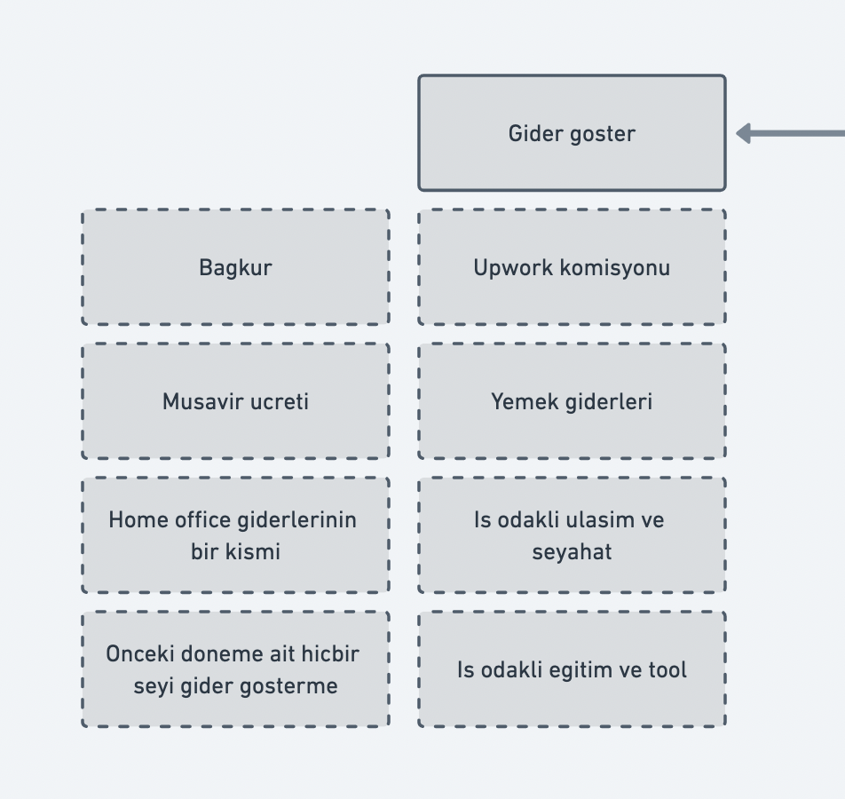
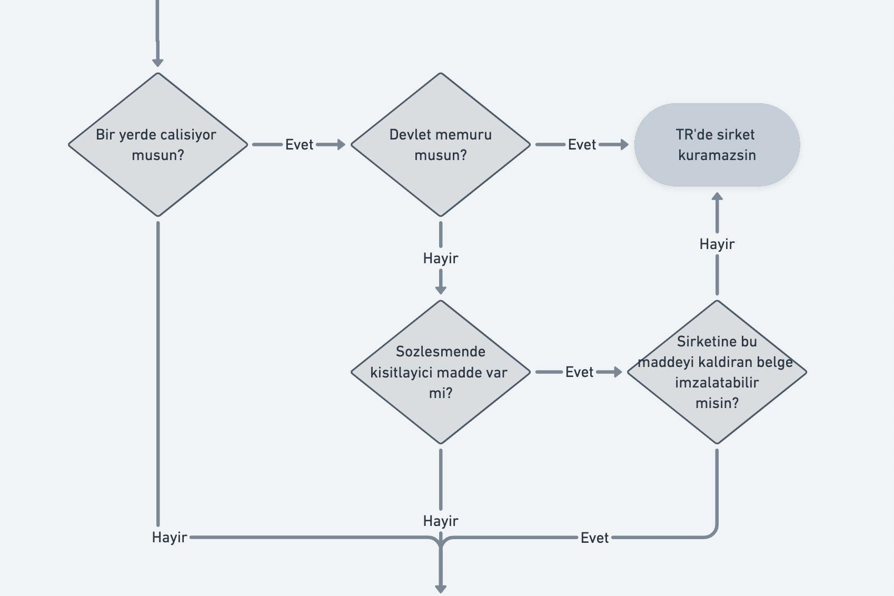
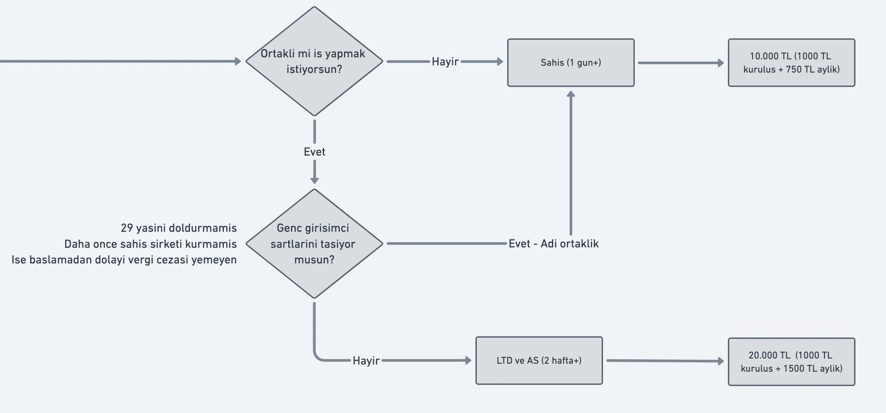
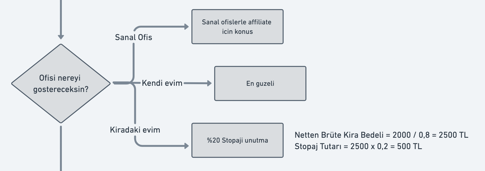
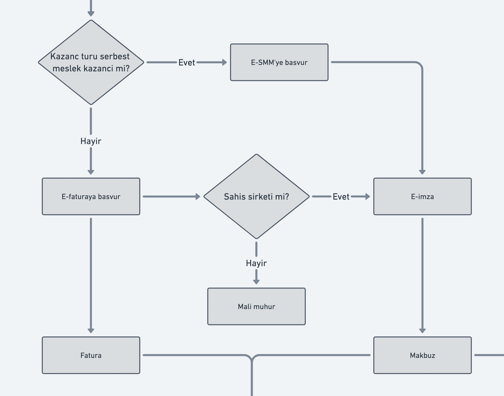
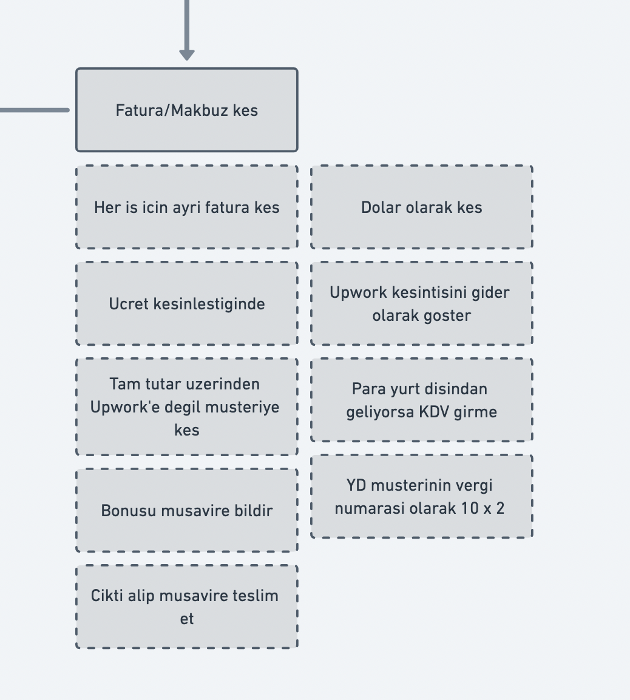

# Freelancerın Finansal Yol Haritası
Upwork ve Fiverr üzerinden ihracat yapan Freelancer'ın şirketleşme, teşvikler, parasını en uygun şekilde ülkemize getirme gibi konularda sorularına cevap bulabileceği bir yol haritası. Daha önce [Freelancer Guide](https://freelancer.guide/)'ın bir parçası idi. Artık açık kaynak kodlu ve herkesin katkısına açık. İlk katkılar her zaman olduğu gibi [Birlikte İhracat](https://birlikteihracat.com/) topluluğu katkılarıyla başlamıştır.

Burası müşavirlik desteği vermiyor. Bu sayfayı lütfen genel kültür aktarımı olarak alın ve lütfen karar vermeden once müşavire danışarak ilerleyin.

Bu doküman, yurtdışına freelance çalışmak ve şahıs şirketi kurmak isteyenlere yönelik hazırlandı. Genel olarak masraflarım neler olacak, ne gibi desteklerden yararlanabilirim gibi sorulara cevap vermeye çalıştık. Aşağıda yer alan bilgiler Eylül 2021 tarihinde derlendi. Lütfen 100% doğru olarak kabul etmeyin ve kendi araştırmanızı yapın. Mali müşavirlere, bu alanda yetkinliği olan kişilere danışın. Aşağıda yer alan bilgiler internetten bulabildiğimiz detayların özeti şeklindedir.

Şirket kurmak zor ve masraflı bir süreç gibi zannedilse de günümüzde hem çok daha kolay, hem de desteklerle ilk aşamada ciddi bir maliyetten kurtulabiliyorsunuz. Yararlanabileceğiniz ve sizi önemli bir masraftan kurtaran iki desteğin detaylarını aşağıda görebilirsiniz. Yaş veya başka bir sebepten dolayı Genç Girişimci Desteği'nden yararlanamıyor olsanız bile ihracat istisnasından yararlanabilirsiniz.

# Özetin de özeti
Eğer yanlış bir kısım gördüysen bana [Twitter](https://twitter.com/zekeriyamulbay)'dan ulaş veya [Discord](https://www.birlikteihracat.com/)'dan direkt yaz. Gerekli olduğunda üzerinde değişiklikler yaparak ilerleriz:
* Freelancer platformlarına kayıt ol.
* İlk işini almak için uğraş ve ilk işini al.
* Paranı henüz çekme ve freelancerlığın sana uygun olup olmadığını anlamaya çalış.
* Gerekirse 1-2 iş daha al.
* Eğer buradan para kazanmayı düşünüyorsan şahıs şirketi kur.
* Ödemeleri şirket hesabına çek ve faturalarını kes.
* Mutlaka vergi ve teşviklerle ilgili genel kültüre sahip ol.
* Temel düzeyde de olsa finansal okur-yazarlık okuması yap.
* Varlık barışı ile ilgili şartlar ve son tarih sürekli değiştiği için lütfen muşavirine danış.

# Gider gösterebileceğin kalemler
Aşağıda bazı "örnek" gider kalemleri yer alıyor. İşinle alakalı harcamaları gider olarak göstermekten çekinme. Unutma, onları harcayacaksın ki işini doğru ve verimli bir şekilde idame edesin.
* Upwork komisyonu
* İş ile alakalı yemek/seyahat giderleri
* Eğitim ve tool ücretleri
* Bağkur
* Müşavir ücreti
* Sanal/fiziki ofis ücreti
* Önceki döneme ait hiçbir şeyi gider olarak gösterme.

# Yararlanabileceğiniz Destekler
## Genç Girişimci Desteği
Genç girişimci hepimizin aklını karıştıran bir konu. Daha önce Upworkten para çektim. Youtuber arkadaşa olan benimde başıma gelir mi? diye içinize dert edindiğinizi biliyorum. Yurtiçi varlık barışı ile şirketinizi açtıktan sonra önceden çektiğiniz gelirleri beyan edebiliyorsunuz. Kanun açık ve net bir şekilde herhangi bir incelemeye yapılmayacağını vergi ödemeyeceğinizi söylüyor. Bu durumda aklınızda oluşan ilk aydınlanma artık genç girişimci olabileceğiniz yönünde. Evet haklısınız genç girişimci için olan yolunuzu açmış oluyorsunuz. Ama bir yandan devlete şirket açmadan önce iş yaptım demiş oluyorsunuz. Bu yüzden genç girişimci istisnasından yararlansanız bile incelemeye girdiğinizde hakkınız elinizden alınabilir ve yararlandığınız miktar ile orantılı olarak ceza yiyebilirsiniz.

**Destek Şartları**
- Detaylarını internette birçok kaynakta da bulabilirsiniz fakat genel olarak (tüm şartları araştırın):
    - 29 yaşını tamamlamamış olmak
    - Daha önce şirket kurmuş olmamak diyebiliriz.

**Destek detayları**
- 3 mali yıl boyunca 75.000 TL'ye kadar gelir vergisinden muafsınız. Bunun tam olarak hesaba nasıl katıldığını aşağıdaki tablolarda görebilirsiniz.
- İlk 12 ay Bağkur primi ödemiyorsunuz.  (1055,37 TL x 12 Ay = 12,664,32 TL cebinizde kalmış oluyor.)

## İhracat Vergi İstisnası (Yazılım-Tasarım İhracatı)

**Destek Şartları**
- Belli alanlarda yurtdışına hizmet vermek.
- Detaylar ile alakalı bulabildiğimiz en güncel bilgi bu linkte yer alıyor: https://www.resmigazete.gov.tr/eskiler/2012/06/20120615-1.htm

> 13. Türkiye'de yerleşmiş olmayan kişilerle, işyeri, kanuni ve iş merkezi yurt dışında bulunanlara Türkiye’de verilen ve münhasıran yurt dışında yararlanılan **mimarlık, mühendislik, tasarım, yazılım, tıbbi raporlama, muhasebe kaydı tutma, çağrı merkezi ve veri saklama hizmeti** alanlarında faaliyette bulunan hizmet işletmeleri ile ilgili bakanlığın izni ve denetimine tabi olarak eğitim ve sağlık alanında faaliyet gösteren ve Türkiye’de yerleşmiş olmayan kişilere hizmet veren işletmelerin münhasıran bu faaliyetlerinden elde ettikleri kazancın %50’si. Bu indirimden yararlanılabilmesi için fatura veya benzeri belgenin yurt dışındaki müşteri adına düzenlenmesi şarttır. Bu bentte yer alan oranı, hizmet alanları itibarıyla sıfıra kadar indirmeye veya %100’e kadar artırmaya Bakanlar Kurulu, bu bendin uygulamasına ve denetime ilişkin usul ve esasları belirlemeye ilgili bakanlıkların görüşünü almak suretiyle Maliye Bakanlığı yetkilidir.

# Vergilendirme Özet
* Yılın 185 günü nerede yaşıyorsan veya uyruğun neresi ise orada vergi veriyorsun - Paranın kaynağı neresi ise orada vergi verdin diyelim. Eğer, TR deki gelir oranı ile verdiğin vergi arasında fark var ise TR de farkı ödüyorsun. Yoksa ödemiyorsun. - Parayı y.dışında tutma ile TR ye getirme arasında bir fark yok. Neden yok? Çünkü, ülkelerin imzaladığı Ortak Bilgi Paylaşımı anlaşması çerçevesinde TR bu paralardan artık haberi var. Şu an ABD bu bilgi ağının dışında. Payoneer HQ USA' da, EU regülasyonuna da tabi olduğu için bilgiyi paylaşır veya talepte bulunan isteğe cevap verir.
* Arızi kazanç vs önemli değil, para geliyor ise 2 ayda 1, haftada 1 fark etmiyor, o şirket kurulacak.
* Para TR ye geldiğinde değil, Upwork te işe başladığınız tarihte faturayı kesmelisiniz. Bu konu TR de işler faturayı kestiğin an vergiye tabiisin. Mesela Estonya da ise bankadan parayı çektiğin an vergiye tabii olursun.
* Devlet seni denetler veya denetlemez, eğer olası bir incelemeden korunmak, sorumluluklarını yerine getirmek istiyorsan oyunu kuralına göre oynaman tavsiye ediliyor.
* 29 yaş altı isen çok avantajlı teşvikler var. Sadece geçmiş kazançların olmadan temiz bir başlangıç yapıyorsan çok iyi, öteki türlü geçmiş evrak bildirmemekten sıkıntı oluyor.
* 29 yaş üstü için ise şirket kurulum, Ssk, damga, stopaj, muhasebeci yıllık min 15.000TL-20.000TL masrafı var, bunu bil. SSK lı olarak bir yerde çalışıyorsan min 10.000TL daha az ödersin - Şu an sadece varlık barışı ile vergisiz para getirebilirsiniz. 2021 Haziran sonuna kadar geçerli. Bir ihtimal yıl sonuna doğru uzatılır.
* Malum herkes ya kazandı ya kazanacak. Oyunu kuralına göre oynamak isteyenler geriye dönük evrakları toparlamalı ve temiz bir başlangıç yapmalı. Piyango size de çıkabilir veya çıkmayabilir, tercih sizin.
Tesekkurler sevgili Burak!

# Çalışan veya devlet memuru olarak şirket açabilir miyim?
Devlet memuru için kısa cevap; Türkiye'de herhangi bir şirketten ticari gelir elde edemezsin. Bir yerde çalışıyorsan aağıdaki maddelere göre ilerleyebilirsin:

Sözleşmende başka bir şirket kurmanı engelleyen bir madde var mı? Evet ise dilekçe ile değiştirebilir misin? Eğer değiştirebilirsen tebrikler. Şirket kurabilirsin; değiştiremezsen sözleşmen gereği Türkiye'de şirket kuramazsın. Sözleşmende başka bir şirket kurmanı engelleyen madde yoksa rahatlıkla şirket kurabilirsin.

Eğer hali hazırda bir yerde çalışıyorsan bağkur ödemesi yapmana gerek yok diye hatırlıyorum. Lakin lütfen maaş aldığın yere azami özen göstererek aldığın maaşın hakkını vermeyi unutma. Amacımız hakkımız olan geliri kazanmak, kimseyi zor durumda bırakmak değil.

# Freelancer olarak hangi şirket türünü seçmeliyim?
Bu doküman karşındaki bütün seçenekleri değil en elverişli birkaç seçeneği önüne döküyor. Bu seçenekler tanıdığım freelancer'ların çoğunun geçtiği yollar. Başka yollar var mı? Tabi ki var ama %10'lük dilime girdiği için enerjimi buraya harcamayı tercih etmiyorum. Örneğin; anonim şirket konusunu hiç açmayacağım. 🤷🏻‍♂️

Sorularımıza başlayalım hadi. İlk sorum; ortaklı mı iş yapmak istiyorsun? Cevabın evet ise diğer sorum genç girişimci satlarını taşıyor musun? Buna da cevabın evet ise adı ortaklık değilse limited şirket açmanı öneririm.

Ortaksız ilerleyeceksen her türlü şahıs şirketi ile "başlamanı" öneririm. Sonrasında gelirine göre Limited'e rahatlıkla geçebilirsin. Bu aşamada vergi avantajından çok kafanı en az ağrıtacak şirket türünü seç ki esas osaklanman gereken kısma yani freelancer olarak gelir üretmeye daha fazla enerji ayırabil.

## Açılış Süreleri
Şirket açılış süreleri değişkenlik gösterse de kabaca aşagıdaki süreleri verebilirim:
Şahıs → 1+ gün
Limited ve Anonim → 2+ hafta

# Şahıs Şirketinin Ana Masrafları
- Kurulum masrafları
- Mali Müşavir - muhasebe ücreti
- Sanal ofis ücreti 
    - Evinizi de ofis olarak gösterebiliyorsunuz fakat onun için kira sözleşmesinde belirtilmesi gerekiyor. Ayrıca tüm kiranızı gider olarak olarak gösteremiyorsunuz. Sanal ofis bu uğraşlardan kurtulmak için en verimli yol gibi gözüküyor.
- Gelir vergisi
- Damga vergileri
- Bağkur

## Şahıs şirket kurulum maliyeti
Dokümandan anladığın üzere burun hesaplamaları "kabaca" sunuyorum. Maliyetleri de bu şekilde vereceğim. Doğal olarak herkesin kendi özel durumuna göre bu miktar artabilir (azalması zor).

Eğer şahıs işletmesi kuruyorsanız ve genç girişimci desteğinden faydalanıyorsanız yıllık maliyetiniz yaklaşık 10bin TL civarında olacak. 1000 TL gibi bir kuruluş ücretinin yanında aylık 750TL'lık gideriniz olacak.

Genç girişimci desteğiniz yoksa ve/veya limited şirket kuruyorsanız yıllık gideriniz yaklaşık 20bin TL olacak. 1000 TL civarı kuruluş ücretinin yanında aylık 1500 TL'lık gider. (Bağkur ödemesine göre bir miktar yukarı çıkabilir)

Aşağıdaki maliyetleri Discord içindeki bir mesajdan aldım. Birkaç ay önce limited şirket açılışı için kullanılan liste:
* Şahıs imza beyannamesi (Noter) 100 TL
* Muhasebeci Vekaleti (Noter) 148 TL
* Şirket Kuruluş Servis Bedeli: 250 TL
* Vergi Dairesi Sözleşme Damga Vergileri: 50 TL
* Toplam şahıs şirketi kurma maliyet: 550 TL
* Şahıs Şirketi Sabit Giderler Ne Kadar?
* 3 ayda bir stopaj (sözleşme yapılan yer kira ise)
* Her ay KDV beyannamesi (58,80 TL damga vergisi)
* 3 ayda bir muhtasar beyannamesi (58,80 TL damga vergisi)
* 3 ayda bir gelir geçici beyannamesi (91,70 TL damga vergisi)
* Yıllık gelir vergisi beyannamesi (122 TL damga vergisi)
* Şahıs Şirketi Kurmak İçin Gerekli Evraklar Nelerdir?
* Mali Müşavir vekaleti
* Tapu fotokopisi ya da kira kontratı
* Nüfus cüzdan sureti
* Vesikalık fotoğrafı
* İmza beyannamesi(noterden)
* İkametgah
* Araç Alış Senedi ve Ruhsat (Varsa)

### Kuruluş Masrafları, Mali Müşavirlik Hizmeti Almak ve Sanal Ofis

Şahıs şirketi kurmak prosedür olarak kolay bir süreç olsa da Mali Müşavir bulup anlaşmak çevrenizde hiç tanıdığınız birisi yoksa uğraştırıcı olabilir. Bu noktada işlerinizi kolaylaştırabilecek bir firma olan mukellef.co'yu önerebiliriz. Doğrudan size yönlendirecekleri bir Mali Müşavir ile şirketinizi hızlıca kurabilirsiniz. 

Mükellef Birlikte İhracat'ın partnerlerinden, Birlikte İhracat üyelerine özel 10% indirimleri de mevcut. İndirimden yaralanmak için Birlikte İhracat'a katılarak [Discord](https://www.birlikteihracat.com/) üzerinden bilgi alabilirsiniz.

**Aylık Masraflar (İndirimsiz)**

Firma | Hizmet | Aylık Tutar (KDV Dahil) | Yıllık Tutar (KDV Dahil)
--- | --- | --- | ---
Mukellef.co | Muhasebe + şirket kuruluşu | 
295 TL
 | 
3,540 TL

Mukellef.co |Sanal Ofis | 
152.22 TL
 | 
1,826.74 TL

**Toplam** | | 
**447.22 TL**
 | 
**5,366.22 TL**

## Şahıs şirketin için ofis seçenekleri
Önünde 3 seçenek var. Kendi evinle ilerleyebilir, kiracı olarak ev sahibinle anlaşabilir veya sanal/fiziki ofis ile anlaşabilirsin.

**Kendi evin var**
En güzel ve temiz seçenek kendi evini göstermek. Herhangi bir ek masraf çıkmıyor.

**Kiracısın**
Eğer kiradaysan ilk yapman gereken ev sahibinle evin iş yeri adresi olarak kullanılmasını konuşmak. İzin vermesi durumunda yaptığınız sözleşmeyi güncellemeniz gerekebilir. Bu seçenekten ilerliyorsan atlamaman gereken konu stopaj ödemesi.

Netten Brüte Kira Bedeli = 2000 / 0,8 = 2500 TL Stopaj Tutarı = 2500 x 0,2 = 500 TL

**Sanal Ofis**
Sanal ofise yaptığın harcamaların tamamını gider olarak gösterebiliyorsun. Ayrıca bu ofislerin bir kısmı her hafta belirli saatler arasında fiziki olarak da çalışma imkanı sunuyor. Freelancerın en büyük dertlerinden biri de sosyalleşmek, diğeri de evde verimli çalışamamak. Bu 2 problemin çözümü de ara sıra da olsa fiziki olarak ofislere gitmekten geçiyor.

### Gelir Vergisi
Gelir vergisi dilimlere göre farklı oranlarda hesaplanıyor. Hem ihracat istisnasından yararlanıp hem de genç girişimci olduğunuz zaman 150.000 TL kazancınıza (=gelir-gider) kadar ilk 3 yıl vergi ödemiyorsunuz. 

Gelir vergisi dilimlere göre farklı oranlarda hesaplanıyor. Hem ihracat istisnasından yararlanıp hem de genç girişimci olduğunuz zaman 150.000 TL kazancınıza (=gelir-gider) kadar ilk 3 yıl vergi ödemiyorsunuz. 

⚠️ Şahıs şirketinde yazabileceğiniz giderler konusunda Mali Müşavir'e danışmakta fayda var. İşiniz ile alakalı olmayan giderlerinizi şirket gideri olarak gösteremiyorsunuz. Aşağıdaki tabloda kullanılan örnek gideri tüm yaşam masraflarınız olarak düşünmeyin, sadece işiniz ile alakalı giderleriniz olarak düşünün. Gerçek gideriniz, şirket giderinizden fazla olacak.

⚠️ Aşağıdaki tablolarda Gelir ve Gider değerleri birden fazla satırda tekrar ediyor, bunun asıl amacı hesaplama sürecinin aşamalarını göstermek, ödenecek vergi satırında göreceğiniz rakamlar o dilim için olan değerleri gösteriyor. Toplam ödenecek vergi en aşağıda yazıyor olacak.

**Gelir Vergisi Dilimleri + 50% Yazılım İhracatı İstisnası + 75.000 TL Genç Girişimci**

Dilimler | Minimum Değer | Maksimum Değer | Vergi Oranı (%) | Gelir | Gider | Vergi Matrahı | - Yazılım İhracatı | - Genç Girişimci | Ödenecek Vergi
--- | --- | --- | --- | --- | --- | --- | --- | --- | ---
1\. Dilim | 0 TL | 24,000 TL | 15 | 192,000 TL | 42,000 TL | 150,000 TL | 75,000 TL | 0 TL | 0 TL
2\. Dilim | 24,000.01 TL | 53,000 TL | 20 | 192,000 TL | 42,000 TL | 150,000 TL | 75,000 TL | 0 TL | 0 TL
3\. Dilim | 53,000.01 TL | 190,000 TL | 27 | 192,000 TL | 42,000 TL | 150,000 TL | 75,000 TL | 0 TL | 0 TL
4\. Dilim | 190,000.01 TL | 650,000 TL | 35 | 192,000 TL | 42,000 TL | 150,000 TL | 75,000 TL | 0 TL | 0 TL
5\. Dilim | 650,000.01 TL | - | 40 | 192,000 TL | 42,000 TL | 150,000 TL | 75,000 TL | 0 TL | 0 TL
**Toplam** | | | | | | | | | **0 TL**|

\
💡 Aynı koşullarda fakat genç girişimci desteğinden yararlanmadığınızı varsayalım:

**Gelir Vergisi Dilimleri + 50% Yazılım İhracatı İstisnası**
Dilimler | Minimum Değer | Maksimum Değer | Vergi Oranı (%) | Gelir | Gider | Vergi Matrahı | - Yazılım İhracatı | Ödenecek Vergi
--- | --- | --- | --- | --- | --- | --- | --- | ---
1\. Dilim | 0 TL | 24,000 TL | 15 | 192,000 TL | 42,000 TL | 150,000 TL | 75,000 TL | 3,600 TL
2\. Dilim | 24,000.01 TL | 53,000 TL | 20 | 192,000 TL | 42,000 TL | 150,000 TL | 75,000 TL | 5,800 TL
3\. Dilim | 53,000.01 TL | 190,000 TL | 27 | 192,000 TL | 42,000 TL | 150,000 TL | 75,000 TL | 5,940 TL
4\. Dilim | 190,000.01 TL | 650,000 TL | 35 | 192,000 TL | 42,000 TL | 150,000 TL | 75,000 TL | 0 TL
5\. Dilim | 650,000.01 TL | - | 40 | 192,000 TL | 42,000 TL | 150,000 TL | 75,000 TL | 0 TL
**Toplam** | | | | | | | | **15,340 TL**|

\
💡 Bu desteklerden yararlanmasaydınız ödeyeceğiniz vergi:

**Gelir Vergisi Dilimleri**
Dilimler | Minimum Değer | Maksimum Değer | Vergi Oranı (%) | Gelir | Gider | Vergi Matrahı | Ödenecek Vergi
--- | --- | --- | --- | --- | --- | --- | ---
1\. Dilim | 0 TL | 24,000 TL | 15 | 192,000 TL | 42,000 TL | 150,000 TL | 3,600 TL
2\. Dilim | 24,000.01 TL | 53,000 TL | 20 | 192,000 TL | 42,000 TL | 150,000 TL | 5,800 TL
3\. Dilim | 53,000.01 TL | 190,000 TL | 27 | 192,000 TL | 42,000 TL | 150,000 TL | 26,190 TL
4\. Dilim | 190,000.01 TL | 650,000 TL | 35 | 192,000 TL | 42,000 TL | 150,000 TL | 0 TL
5\. Dilim | 650,000.01 TL | - | 40 | 192,000 TL | 42,000 TL | 150,000 TL | 0 TL
**Toplam** | | | | | | | **35,590 TL**|

\
Desteklerden yararlandığınızı varsayarak farklı rakamlarla bir örnek daha verelim:\
💡 Aylık 30.000 TL kazanıyorsunuz ve 5.000 TL gideriniz var.

**Gelir Vergisi Dilimleri + 50% Yazılım İhracatı İstisnası + 75.000 TL Genç Girişimci**

Dilimler | Minimum Değer | Maksimum Değer | Vergi Oranı (%) | Gelir | Gider | Vergi Matrahı | - Yazılım İhracatı | - Genç Girişimci | Ödenecek Vergi
--- | --- | --- | --- | --- | --- | --- | --- | --- | ---
1\. Dilim | 0 TL | 24,000 TL | 15 | 360,000 TL | 60,000 TL | 300,000 TL | 150,000 TL |75,000 TL | 3,600 TL
2\. Dilim | 24,000.01 TL | 53,000 TL | 20 | 360,000 TL | 60,000 TL | 300,000 TL | 150,000 TL |75,000 TL | 5,800 TL
3\. Dilim | 53,000.01 TL | 190,000 TL | 27 | 360,000 TL | 60,000 TL | 300,000 TL | 150,000 TL |75,000 TL | 5,940 TL
4\. Dilim | 190,000.01 TL | 650,000 TL | 35 | 360,000 TL | 60,000 TL | 300,000 TL | 150,000 TL |75,000 TL | 0 TL
5\. Dilim | 650,000.01 TL | - | 40 | 360,000 TL | 60,000 TL | 300,000 TL | 150,000 TL |75,000 TL | 0 TL
**Toplam** | | | | | | | | | **15,340 TL**|

### Damga Vergisi
Vergi | Ödeme Sıklığı | Tutar | Yıllık Toplam 
--- | --- | --- | ---
KDV Beyannamesi Damga Vergisi | Her Ay | 
64.10 TL
 | 
729.20 TL

Geçici Vergi Beyannamesi Damga Vergisi | 3 Ayda Bir | 
152.22 TL
 | 
388.80 TL

Gelir Vergisi Beyannamesi Damga Vergisi | Yılda Bir | 
152.22 TL
 | 
133.00 TL

Muhtasar Beyanname Damga Vergisi | 3 Ayda Bir |
0 TL
 | 
0 TL

**Toplam** | | | 
**1,291 TL**

💡 Muhtasar beyanname damga vergisi, stopaj kesintisi olması halinde 64,1 TRY.
Faaliyet adresinin veya kullanılan aracın kiralık olması durumunda ya da tarafına serbest meslek makbuzu kesilmesi halinde stopaj kesintisi oluyor.\
Mukellef.co sanal ofis hizmeti için fatura düzenlediğinden stopaj yok.\
Mukellef.co Mali Müşaviri, muhasebe hizmetine karşılık fatura düzenlediği için stopaj yok.

## Hangi muhasebe yazılımını kullanmalısın?
Sadece freelancer platformları üzerinden çalışacaksan e-dönüşüm destekli yazılım yeterli ama yanlış kesılan faturanın düzeltilmesi ve gelen fatura takibinin olmaması gibi problemleri de yanında getiriyor.

Eğer gelir kalemlerin daha çeşitli olacaksa ve Gelir/gider takibi yapabilmek istiyorsan bu sefer Paraşüt (1000 TL + KDV) veya Logo İş Başı (600 TL _ KDV) gibi programları kullanmak gerekecek.

# Freelancer nasıl fatura kesmeli?
* Her iş için ayrı fatura kesmelisin.
* Ödemeyi aldığında değil ücret kesinleştiğinde kesilmeli.
* Tam tutar üzerinden (freelancer platformlarının ücretleri düşülmeden) platforma değil son müşteriye kesilmeli
* Bonusu ayrıca müşavirine bildirmelisin
* Hangi para birimiyle iş aldıysan o birimde faturayı kesmelisin.
* Upwork ve diğer platform kesintilerini gider olarak muhasebeleştirmelisin.
* Para yurt dışındaki müşteriden geliyorsa KDV girme, müşteri veri numarası olarak 10 adet 2 girebilirsin.
* Upwork/freelancer işinin ID'si ve adı da açıklama kısmına yazılırsa güzel olur.

## Fatura mı keseceğim yoksa makbuz mu?
Bunu belirlemek için sormak istedigim ilk soru serbest meslek erbabı mısın?

Serbest meslek faaliyetini kendi nam ve hesabına, mutat meslek halinde ifa eden; avukat, doktor, dış hekimi, veteriner hekim, mimar, mühendis, müşavir, serbest muhasebeci mali müşavir, yeminli mali müşavir, danışman, ressam, yazar, bestekar, kimyager, noter, öğretmen, artist, menajer, senarist, yönetmen, ebe, sünnetçi, arzuhalci, rehber ve sağlık memuru vb. kişiler serbest meslek erbabıdır.

Eğer gelirin serbest meslek kazancına giriyorsa E-SMM'ye; değilse e-faturaya başvurman gerekiyor. Gelin yine madde madde açıklayalım:

Serbest meslek erbabı mısın?
* Evet → E-SMM'ye başvur → E-imza al → Makbuz kes
* Hayır → E-faturaya başvur → Fatura kes (Şahıs şirketi → E-imza, Diğer şirket türleri → Mali mühür)

## Faturayi hangi ülkeye kesiyorsun?
Freelancer platformları üzerinden çalışıyor olsanız da paranız yurt dışından gelse de eğer iş yaptığınız son müşteri Türkiye'de yerleşik ise faturayı + KDV ile kesmeniz gerekiyor. Stopaj da var ama gider gösterilebildiği için hesaba katmaya gerek yok.

Yurt dışı yerleşik müşteriler için stopaj da KDV'de yok.

## Faturayı kime kesmeliyiz?
Business literatüründe platformlar çeşitli alt kollara ayrılır. Şu anki tartışmaya ilişkin en faydalı olabilecek alt kollar şu şekilde: 
- Marketplaces (e.g. AirBnB, Booking, Amazon, Udemy, E-Bay, Upwork, Fiverr, etc)
- On-Demand Platforms (e.g. Uber, Glovo)
- Classified Platforms (Craigslist, Letgo, etc) 

**Classified Platforms** --> Platformda ilan vermek için para ödersiniz. Value/Money transfer, platform DIŞINDA gerçekleşir. Upwork, transaction'ı kendi üzerinden geçirdiği için Classified değil. 

**On-Demand Platforms** --> Bu platform tipinde transaction, platform üzerinden geçer ve platform transaction üzerinden bir "take-rate" keser. Platform üzerinde kendi ürün/hizmetinizle bulunamazsınız; platformun belirlediği standartlara uymanız gerekir. Ek olarak; taşıdığınızı yolcuyu da bilmezsiniz; Uber kendi müşterisine taşıma hizmeti verirken sizi "outsource" olarak kullanmış olur. Bu durumda Uber sürücüsü olarak faturayı Uber'e kesersiniz. 

**Marketplaces** --> Bu platform tipinde transaction, platform üzerinden geçer ve platform transaction üzerinden bir "take-rate" keser. Platform üzerinde kendi ürün ve hizmetinizle bulunabilirsiniz. Platform size herhangi bir standardizasyon uygulamaz. Ek olarak; hizmet verdiğiniz şahıs ya da kurumu detaylı olarak tanırsınız. Platform, işin kaliteli olması durumunda ekstra ödül, kalitesiz olması durumunda ise cezaya katlanmaz (Ajans/Consulting modelinden farklar). Bu durumda ise Upwork/Fiverr, etc platformda hizmet veren kişi olarak faturayı, hizmet verdiğiniz müşteriye kesersiniz, platformun sizden aldığı "take-rate" miktarını da gider göstererek muhasebeleştirirsiniz. On-Demand ve Marketplace paltformlar birbirleriyle karıştırılması kolay olan iş modelleri. Aralarındaki en büyük fark; standardizasyon ve hizmet verdiğiniz müşteriyi tanıma/tanımama durumu. Fatura keserken, NOT alanına şu notları mutlaka ekliyorum: - Hizmet İhracatı kapsamında KDV oranı %0 olarak hesaplanmıştır - Upwork Invoice ID - Upwork Invoice file ID (pdf'in isminde yazan ID ile Invoice ID farklı oluyor -- aralarında genelde 2 fark oluyor) - Upwork Contract Number

Banka transaction'ında parayı gönderen olarak Upwork yazabilir. Herhangi bir soru sorulması durumunda, bu geliri Upwork üzerinden, ilgili müşterilere faturaları keserek elde ettiğinizi ispat edebilirsiniz. Ek olarak; zaten para size gelirken Upwork'ten \$1000 olarak yola çıksa bile sizin hesabınıza gelene kadar yolda kesintiler olacak. Bu durumda da zaten miktarda uyuşmazlık olacak. Buna karşılık; "para bana ulaşınca, ulaşan miktar kadar keseyim o halde" tezi ise, modern muhasebede takip edilen, 'Gelirin hak kazanıldığı zaman, giderin ise oluştuğu zaman muhasebeleştirilmesi gerekliliği' ilkesine ters düşecektir (Bknz. Accrual Accounting vs Cash-Based Accounting)

Tüm bunlar düşünüldüğünde; aslında takip edilmesi gereken usul oldukça net görülebiliyor: Faturayı müşteriye kes, Upwork kesintisini ise gider olarak göster. Geliri de gideri de banka hesabına gelmesini beklemeden, oluştuğu tarihte muhasebeleştir.

# Kazancınızı Türkiye'ye en az kesintiyle getirmek
Payoneer aracılığıyla \$ hesabına ve direct to local bank yöntemiyle TL hesabına aktarım arasındaki farkı gösteren bir hesaplama yaptım herkesin kafasında bir fikir oluşması için yardımcı olur umarım. (anlık kur -7.94- ve banka olarak enpara baz alındı.)

\$200.00 (1,588.00TL) için Payoneer ile \$ hesabına;
* 2\$ Upwork kesiyor kaldı \$198.00
* \$ hesabına aktarım için Payoneer %2 kesiyor kaldı \$194.04 -194.04x7.94=1,540.68 TL
* En para swift işlemi başına 20TL ücret alıyor. -Elimize geçen para net olarak 1,520.68 TL -Kesilen miktar \$8.48 yani 67.32TL

\$200.00 (1,588.00TL) için direct to local bank ;
* 0.99\$ Upwork kesiyor kaldı \$199.01
* Upwork'ün belirlediği kur 7.70
* Enpara bu yöntemde herhangi bir aktarım ücreti almıyor.
* Elimize geçen para 199.01x7,70=1.532,38TL
* Kesilen miktar \$7.00 yani 55.62TL

\$500.00 (3,970.00TL) için Payoneer ile \$ hesabına;
* 2\$ Upwork kesiyor kaldı \$498.00
* \$ hesabına aktarım için Payoneer %2 kesiyor kaldı \$488.04
* 488.04x7.94=3,875.04 TL
* En para swift işlemi başına 20TL ücret alıyor.
* Elimize geçen para net olarak 3,855.04 TL
* Kesilen miktar \$14.48 yani 114.96TL

\$500.00 (3,970.00TL) için direct to local bank ;
* 0.99\$ Upwork kesiyor kaldı \$499.01
* Upwork'ün belirlediği kur 7.70
* Enpara bu yöntemde herhangi bir aktarım ücreti almıyor.
* Elimize geçen para 499.01x7,70=3,842,38TL
* Kesilen miktar \$16.07 yani 127.62TL

\$1,000.00 (7,940.00TL) için Payoneer ile \$ hesabına;
* 2\$ Upwork kesiyor kaldı \$998.00
* \$ hesabına aktarım için Payoneer %2 kesiyor kaldı \$978.04
* 978.04x7.94=7,765.64 TL
* En para swift işlemi başına 20TL ücret alıyor.
* Elimize geçen para net olarak 7,755.64 TL
* Kesilen miktar \$23.22 yani 184.36TL

\$1,000.00 (7,940.00TL) için direct to local bank ;
* 0.99\$ Upwork kesiyor kaldı \$999.01
* Upwork'ün belirlediği kur 7.70
* Enpara bu yöntemde herhangi bir aktarım ücreti almıyor.
* Elimize geçen para 999.01x7,70=7,692.38TL
* Kesilen miktar \$31.19 yani 247.62TL

\$1,000.00 (7,940.00TL) için wire transfer yöntemi;
* 30.00\$ Upwork kesiyor kaldı \$970.00
* 970.00x7,94=7,701.80TL
* En para swift işlemi başına 20TL ücret alıyor.
* Elimize geçen para net olarak 7,681.80 TL
* Kesilen miktar \$32.52 yani 258.20TL

Normal koşullarda direct to local bank yöntemiyle para 24 saat içinde hesaba geçiyor.(Benim genelde min 12 saat sürdü.) Payoneer yönteminde para çok kısa bir süre içinde Payoneer'a aktarılıyor. Payoneer'dan enpara \$ hesabıma aktarmak da 1,5 saat sürdü.

Wire transfer yöntemini hiç kullanmadım.

Benim düşüncem düşük miktarlı işlemlerde direkt TL hesabına aktarmak daha mantıklı. +\$500.00 olduğunda da Payoneer daha mantıklı. (tam kırılma noktasını hesaplayamadım malesef.)

Yukaridaki mesaj icin Oğuz'a tesekkur ederim.

# Yurtdışına para gönderimi ve alımı süreci
Yurt dışına para gönderimi ve alımı şöyle oluyor. Eğer gönderen ve alan banka muhabir banka değilse.\
1- Hesabınızın olduğu bankadan muhabir bankaya talimat gider.\
2- Muhabir banka bunu swift sistemine iletir.\
3- Swift sisteminden karşı muhabir bankayı iletilir.\
4- arşı muhabir bankadan karşı hesabın olduğu bankaya iletilir.\
5- Karşı banka ilgili hesaba parayı yatırır.

Madde haricinde olan adımların hepsinde manuel onay oluyor. Bundan dolayıdır ki bazen yurtdışına para gönderimlerin/alımlarında süreler uzayabiliyor. Bu süreyi kısaltmanın yöntemleri var. Fakat eğer gönderen siz değilseniz bu süreyi kısaltmanız tamamen karşı taraftan gönderene kalıyor. Karşı taraf eğer bir kurumsa bunu kendine göre komisyonu uygun olacak şekilde yapıyor. (Yani en hızlı şekilde olmuyor genelde.) Swift işlemleri ile alakalı birkaç bilgi daha vereyim. Eğer siz para gönderen olacaksanız veya alıcı olun (Karşıdaki gönderen kişi/birey ise), swift formunu doldurduğunuzda (eskiden kağıt formu doldururdunuz, çoğu banka internet sitelerini yeni yeni getiriyor bunu.) maliyetin nasıl kesileceğinine dair alan görürsünüz. değerleri our/sha/ben bunlardır. - Our tüm komisyonları (hem gönderen hemde alıcı tarafındaki) gönderdiğim miktardan kesme ben sana bunu vereceğim ayrıca demek oluyor. - Sha gönderen tarafındakileri ben ödeyeceğim alıcı tarafındakileri ise giden paradan kesip kalanı alıcıya ödeyin. - Ben ise tüm komisyonları giden paradan kesip kalanı alıcıya iletin demek oluyor. Peki hızlı nasıl para gönderiliyor. Aynı şekilde para gönderirken sizden işlem tarihini ister (yani bu para en yakın hangi tarihte karşıya ulaşsın). Eğer bugünü seçerseniz sizden en yüksek komisyon tutarları ile gönderim yapıp karşıya aynı günde iletirler. (öğleden önce gönderirseniz ulaşır, öğleden sonra bir sonraki güne ulaşır.) Normalde işlem süresi 3-4 iş günüdür. Bugünkü bankacılık dersimizin de sonuna geldik .

Teşekkürler Mehmet!
